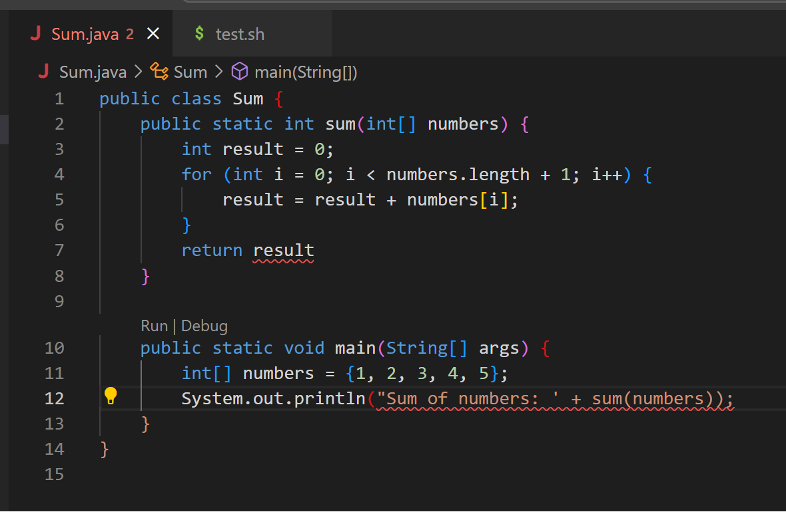
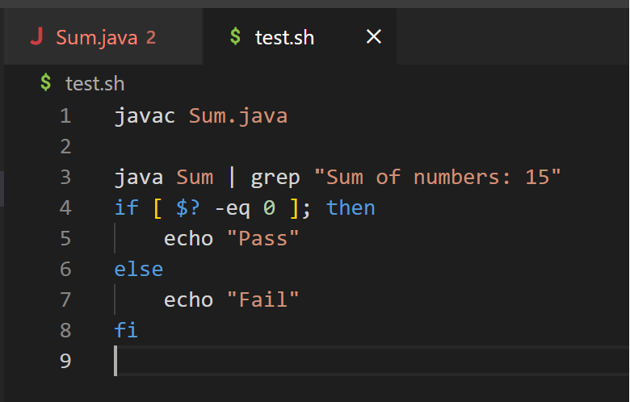
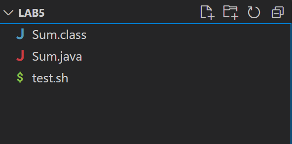
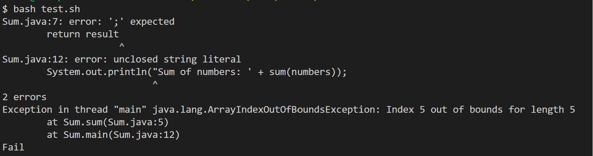
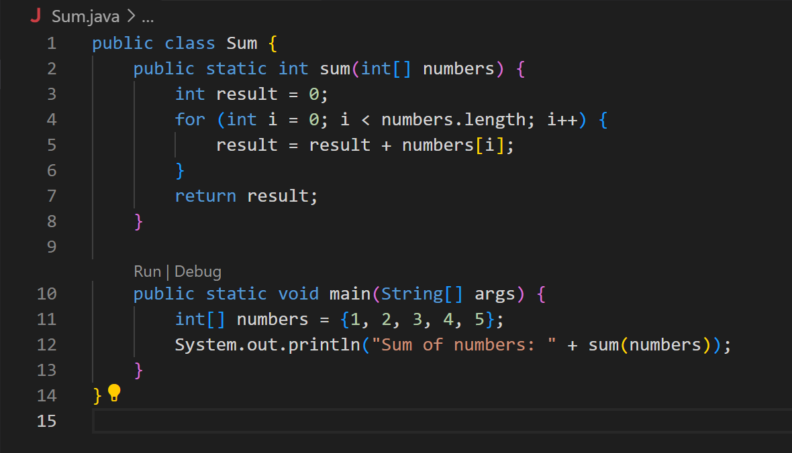
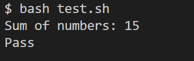

**CSE15L Lab Report 5**

Student:

Hi TAs! I have been having some trouble with writing a sum method to calculate the sum of an array. I attached my code and tests below. 


This is the file and directory structure:


TA:

Using your current code and tester file, I got these error messages. This is the output of ```test.sh``` when I run it. It seems like you're missing a semicolon somewhere in your code, you have an unclosed string literal, and an index out of bounds error. For the index out of bounds error, I would suggest you take a look at your sum function and trace each iteration when adding. For the other errors, how can you use the ```test.sh``` output message to help you? Good luck! 




Student: I finally found where the missing semicolon was because of the error message! For the unclose string literal, I accidentally used ```"``` and ```'```. For my sum method, my error was adding one to length, causing it to go out of bounds on the last iteration. I attached my updated code and test output. Thank you for the help! 



